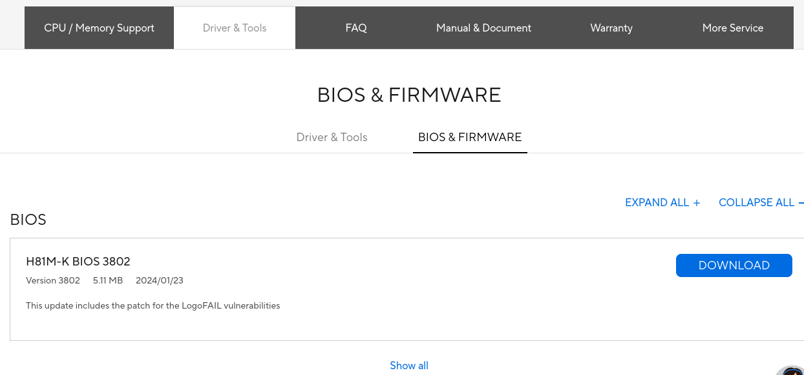
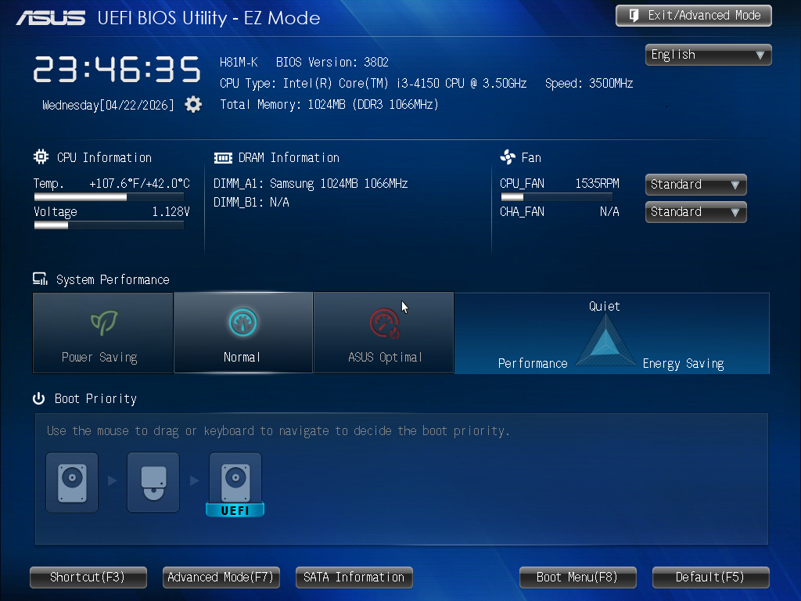
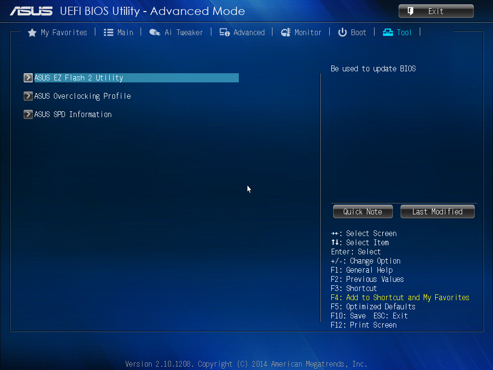
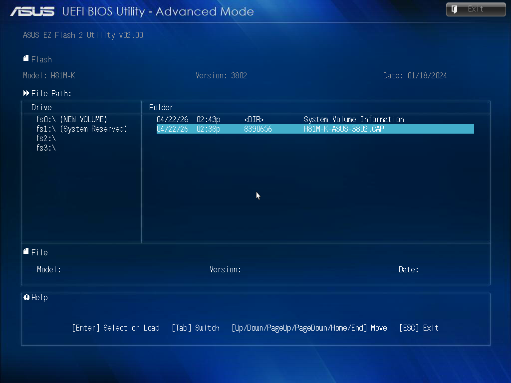

## Introduction
Updating your motherboard BIOS can improve system stability, add support for new hardware, and fix bugs. ASUS provides a built-in tool called EZ Flash Utility, which makes the process simple and safe without needing for additional software.

In this guide, you’ll learn how to update your ASUS motherboard BIOS step by step using EZ Flash.

## Prerequisites
- A USB flash frive formatted to **FAT32**. (Otherwise it will no be detected by EZ Flash).
- A UPS (Uninterruptible Power Supply) is recommended. A sudden power loss during the update can **brick your motherboard**.

### Downloading the Correct BIOS File

1. Visit the official [ASUS Download Center](https://www.asus.com/support/Download-Center/).
2. Enter your **exact motherboard model**  into the search bar.
3. Go to the **Driver & Utility** section, then select the **BIOS & Firmware** tab.
4. Download the **latest BIOS version** available.
5. Extract the downloaded `.zip` file. You will find a `.CAP` file.
6. Copy the `.CAP` file directly to the root directory of your **FAT32-formatted USB flash drive**.

## Updating Bios

1. Restart your computer.
2. As the system boots, repeatedly press **DEL** or **F2** (depending on your model) to enter the BIOS menu.

3. Once inside the BIOS, press **F7** to switch to **Advanced Mode**.

4. Navigate to the **Tool** tab and select **ASUS EZ Flash Utility**, then press **Enter**.

5. In the EZ Flash Utility, locate your USB flash drive.
6. Select the `.CAP` file you copied earlier.
7. Confirm the update by selecting **Yes**.

A progress bar will appear. **Do not turn off or restart your system during this process.**

8. Once the update is complete, your system will restart automatically.

## After the Update
1. Re-enter the BIOS menu.
2. Press **F5** to load **Optimized Defaults** (recommended for stability).
3. Press **F10** to **Save & Exit**.

## References
- [How to Update BIOS with ASUS Firmware Update/EZ Flash - asus.com](https://www.asus.com/support/faq/1008859/)
- [How to Safely Update BIOS on ASUS Motherboard - tech2geek.net](https://www.tech2geek.net/how-to-safely-update-bios-on-asus-motherboard-step-by-step-guide/)
